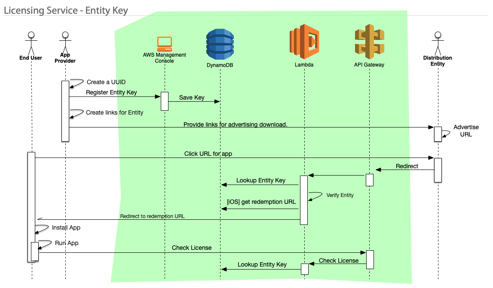

[< back](../index.md)
# Licensing Service - Entity Keys (AWS)

## Overview
This design uses AWS components as the basis for a licensing service. This design addresses the use of Entity (license) Keys throughout the lifecycle of the product.

The intent of this design is to require minimal UI development and assumes that some familiarity with the AWS console has been or can be readily obtained.

## Descriptions
`End User`. The end user of the system. This also represents the application that the end user downloads.

`App Provider`. The owner of the application and the one licensing it to others for distribution.

`Distribution Entity`. The licensed distributor of the application.

`AWS Management Console`. The web-based console accessing AWS components for setup, monitoring and maintenance.

`DynamoDB`. AWS's database service. Used to hold Entity (License) Keys and also redemption URLs for downloading the private app from the app store (iOS).

`Lambda`. A "serverless" function used to process web requests when accessing the database.

`API Gateway`. Provides access to the licensing service through a defined API (Application Programming Interface). This importantly provides mechanisms to secure the API against unwanted access.

## Interactions
The `App Provider` application provider (you) creates a UUID (the key) for a Distribution Entity and enters it directly into the database using the AWS Console. At a mimimum the database record should contain the Entity name and the UUID.

The `App Provider` manually generates the download links (a script could be employed here for consistency) based on the UUID (Key) previously created. It is expected that there is a unique link for iOS and Android apps since they will require different processing. The links also contain iniatialization data that includes the `Distribution Entitiy's` Key so the downloaded app can initialize for that particular distributor.

The `Distribution Entity` publishes the customized download links to their customers. This could be via website or email campaign.

When the `End User` initiates the app download their browser navigate to the licensing service through the API Gateway. A lambda attached to the API Gateway endpoint will parse the incoming URL and determine if the entity key (license) is valid. If so, for iOS downloads, it will retrieve a redemption URL from the database* and redirect the user to that URL. Once the URL is delivered to the customer the redemption URL is removed from the database (they can only be used once). The redirection URL is accompanied by a data set that identifies the `Distribution Entity` which will initialize the app and associate it with a particular `Distribution Entity`. 

When the app is downloaded it is initialized with the `Distribution Entity` identifier and is subsequently used to query the license service (via the API Gateway) to determine if the entity is valid.

*Note: the redemption URLs are maintained in a separate database from the licensing keys but are shown as a single entity in the diagram for simplicity.

## Development References

### Serverless Stack Development

While it is possible to assemble these AWS components manually through the AWS console it is recommended that a templated approach be taken. This will help greatly when updating the system over time. 
- Reference: [Serverless Stack](https://sst.dev)

### Database
DynamoDB is a fully managed no-SQL database. Super easy to setup.
- Reference: [DynamoDB](https://docs.aws.amazon.com/amazondynamodb/latest/developerguide/Introduction.html)

### API Gateway/Lambda
The API Gateway and Lambda functions work hand-in-hand to provide web-accessible functionality for the app and the customized distribution entity links. The API provides the interface and the Lamba provides the custom functionality.
- Reference [API Gateway](https://docs.aws.amazon.com/apigateway/?icmpid=docs_homepage_serverless)
- Reference [Lambda](https://docs.aws.amazon.com/lambda/?id=docs_gateway)

### Security
AWS Cognito should be considered to lock down access to the API from the app.
- Reference: [Cognito](https://docs.aws.amazon.com/cognito/?id=docs_gateway)