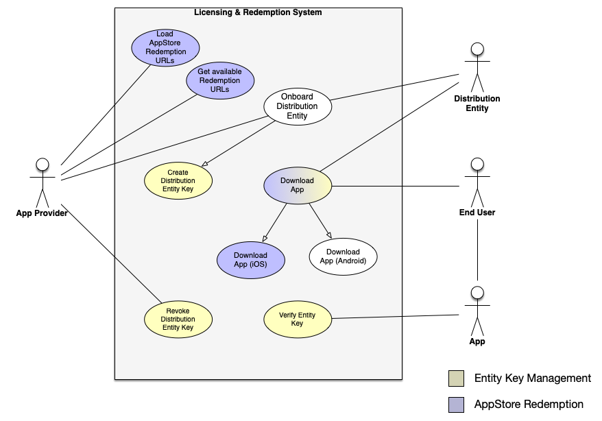

[&lt; back](../README.md)

# Licensing and Redemption System Design

The goal of the Licensing and Redemption System is to support private distribution of an application to end users through authorized distributors. Requirements are epressed as Use Cases and constraints and the designs address two aspects:

- The overall interactions to include processes, procedures and/or web UX required to fullfill particular use cases or scenarios.
- A custom licensing service to addresses the functionality to be implemented as a programatically accessible service.

## Requirements

### System Constraints

- Private distribution for iOS and Android apps through authorized distributors only.
- Applications distributed to users should only work if the distribution entity remains authorized.

### Use Cases

### Actors

- App Provider
- Distribution Entity
- End User
- App

### Use Case Descriptions

- [Load Appstore Redemption URLS](use-cases/load-appstore-redemption-urls.md)
- [Get Available Redemption URLs](use-cases/get-available-redemption-URLs.md)
- [Onboard Distribution Entity](use-cases/onboard-distribution-entity.md)
  - [Create Distribution Entity Key](use-cases/create-distribution-entity-key.md)
- [Download App](use-cases/download-app.md)
  - [Download App (iOS)](use-cases/download-app-ios.md)
  - [Download App (Android)](use-cases/download-app-android.md)
- [Get App Store Redemption URL (iOS)](use-cases/get-appstore-redemption-url.md)
- [Verify Entity Key](use-cases/verify-distribution-entity-key.md)
- [Revoke Distribution Entity Key](use-cases/revoke-distribution-entity-key.md)

## Designs

- [Licensing Service - Entity Keys (AWS)](designs/LicensingService_EntityKeys_AWS.md)
